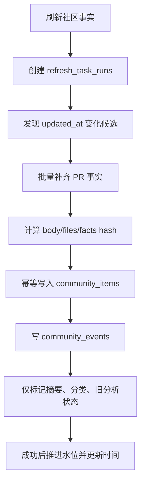

# PR/Issue 社区事实刷新

本文用 `vllm-ascend` 仓库手动刷新为例，解释 PR/Issue 怎样从 GitHub 进入 D1。vLLM 使用完全相同的流程，只是仓库配置不同。

## 入口与运行记录

用户点击“刷新社区事实”后：

```text
POST /api/repositories/vllm-ascend/refresh/facts
```

Worker 会先创建 `refresh_task_runs`，记录本次触发类型、基础水位、状态和进度。整仓库 facts 任务进入后台队列并返回 202，页面继续浏览；单条详情刷新携带 `itemId`，只处理指定 PR/Issue。



对应代码：

- API 入队：`frontend/worker/routes/api.ts`
- 运行状态机：`frontend/worker/services/refresh-management.ts`
- Facts Handler：`frontend/worker/services/refresh-handlers/facts.ts`
- 事实编排：`frontend/worker/services/facts-refresh.ts`

## 第一步：确定扫描边界

每个账户、仓库、任务保存 `watermark_updated_at`，它只在整次成功后更新。

- 已成功刷新过：下界为上次成功水位；
- 首次刷新：下界为“首次活跃范围”，例如 24 小时、3 天、7 天或 30 天前；
- 查询使用 `updated_at >= 下界`，包含边界；
- 页面按 GitHub `updated_at DESC` 翻页，一旦某页出现早于边界的条目即停止；
- 如果翻到安全上限仍没到达边界，整次失败，水位不前移。

包含边界会重复读取同一时间戳，但不会漏掉同一秒更新的多个条目。D1 唯一键负责去重。

## 第二步：用一次列表扫描发现 PR 和 Issue

整仓库刷新调用 GitHub：

```text
GET /repos/vllm-project/vllm-ascend/issues
    ?state=all&sort=updated&direction=desc&per_page=100
```

GitHub 的 Issues 列表同时返回 Issue 和带 `pull_request` 标记的 PR，因此当前实现用一个分页序列发现两类候选，再在内存中拆成 `pulls` 和 `issues`。这比同时扫描 `/pulls` 和 `/issues` 少一套分页请求。

每页通过 Link Header 跟随 `next`，最多 100 页。候选按编号放入 Map，同一 PR/Issue 重复出现时保留更新时间更新的记录。

Facts 任务不使用 `maxItems` 截断发现结果：如果只处理前 N 条却推进全局水位，可能永久跳过同一范围内的其余条目。当前通过水位和活跃范围控制扫描量。

## 第三步：批量获取 PR 详细事实

Issue 列表数据已经包含标题、正文、作者、标签、状态、评论数和时间，当前不再逐条请求 Issue 详情。

PR 还需要 Base/Head SHA、合并状态、Review、CI 和文件统计。当前使用 GitHub GraphQL 按 20 个 PR 编成一个请求：

```text
pull0: pullRequest(number: ...)
pull1: pullRequest(number: ...)
...
pull19: pullRequest(number: ...)
```

每个别名一次返回：

- 标题、正文、状态、Draft、作者、标签和时间；
- `baseRefOid`、`headRefOid`、merge commit；
- mergeability、merge state、review decision；
- changed files、总增删行、评论与 review 总数；
- 前 100 个文件的路径与增删行；
-最后一个 Commit 的最多 20 个 Check/Status Context。

最多同时执行 3 个 GraphQL 批次。若一个批次失败，会二分为更小批次重试，直到定位到单个失败 PR；任何目标 PR 缺失都会让整次任务失败并保持水位。

当前批量快照刻意不调用 Compare API，因此 `behindBy` 在批量刷新中为未知；这是为了避免每个 PR 再消耗一次 REST Core 请求。评论数字使用 Issue Comments 与 Reviews 总数之和，不再单独拉取完整评论正文。

## 第四步：补齐超过 100 个文件的 PR

GraphQL 快照只包含前 100 个文件。若 `hasNextPage=true`，系统以每批 4 个 PR 的并发继续分页获取文件统计，最多保存 3000 个文件。这里仍只保存路径、additions 和 deletions，不读取代码 Patch。

如果 GraphQL 不可用，单条刷新或降级路径可使用 REST `/pulls/{number}/files?per_page=100`。整仓库批量刷新要求 GitHub Token；没有 Token 时直接提示配置，避免退化为大量匿名 REST 调用。

## GitHub 调用量如何估算

假设刷新窗口发现 73 个条目，其中 52 个 PR，且 3 个 PR 超过 100 个文件：

| 调用 | 估算 |
| --- | --- |
| Issues 列表发现 | 取决于到达水位所需页数，例如 1–2 次 REST |
| PR GraphQL 快照 | `ceil(52 / 20) = 3` 次 GraphQL |
| 超大 PR 文件续页 | 每个未完整 PR 至少 1 次 GraphQL，示例约 3 次 |
| Rate Limit 刷新 | 完成后 1 次 REST `/rate_limit`，失败不影响主结果 |

不是“73 个条目就发 73×5 次请求”。只有单条 PR 刷新或 GraphQL 降级时才会更多使用 REST 详情路径。

## 第五步：计算变化与过期标记

每条记录计算：

- `body_hash`：正文；
- `files_hash`：文件路径与增删行列表；
- `facts_hash`：标题、正文 Hash、状态、标签、评论、SHA、文件 Hash 和 Review 信号；
- `content_hash`：标题、正文和状态的兼容摘要输入标识。

比较旧记录后得出 `titleChanged/bodyChanged/headChanged/filesChanged/ciChanged/commentsChanged`。Facts 任务只据此：

- 标记摘要 `missing/stale`；
- 标记分类 `possibly_stale`；
- Head 变化时把旧分析文档标为旧版本；
- 写入社区状态事件。

它不会在这里调用 AI 或执行分类。完成后只把待分类任务的计划时间设为可运行，由独立分类任务处理。

## 第六步：幂等写入与成功水位

`saveCommunityFacts` 以业务唯一键批量 Upsert。随后更新仓库 PR/Issue 当前总数和 `last_synced_at`。

只有全部步骤成功后，`completeRefreshTaskRun` 才更新：

- `last_successful_at`；
- `watermark_updated_at`；
- `next_scheduled_at`；
- 本次 item count。

失败只更新 `last_attempted_at/status/last_error`，下一次仍从旧水位重跑。单条详情刷新不推进仓库水位。

## 页面如何看到进度

刷新阶段会写回 `current_stage/progress_current/progress_total`，例如：

```text
discovering
discovered
enriching
enriching_files
preparing_writes
saving_facts
finalizing
```

仓库头部每 2.5 秒读取 `/api/repositories`。任务结束后重新读取列表、今日事件、关注列表和侧边栏数量；不是把 GitHub 响应直接塞进前端。

## 当前实现明确不做的事

- 不读取评论正文；
- 不在刷新时获取完整 Patch；
- 不逐 PR 调用 Compare 获取 behind count；
- 不生成摘要；
- 不自动覆盖分类；
- 不运行深度分析；
- 不因用户打开列表或详情而刷新。
