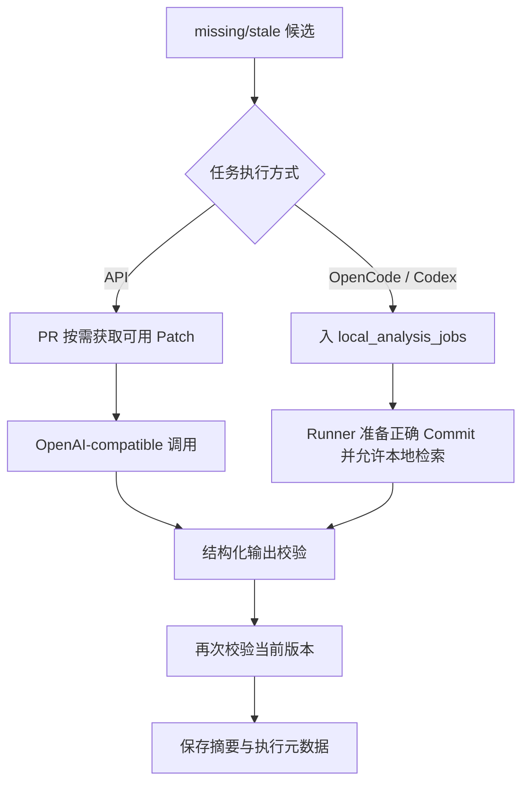

# 摘要、分类与深度分析

三个功能都可能使用 AI，但它们不是同一个任务：摘要回答“这条内容做了什么”，分类只输出一个主技术领域，深度分析生成完整技术报告。

## 三类任务对比

| 维度 | 摘要分析 | 分类标签 | 深度分析 |
| --- | --- | --- | --- |
| 默认触发 | 周期处理 missing/stale | 首次进入数据库 | 仅手动 |
| 主要输入 | 正文、版本、文件统计、必要 Patch、Review | 路径、测试路径、CODEOWNERS、标签、标题正文 | 正文、Diff、Review、本地代码、用户补充要求 |
| 输出位置 | `community_items.ai_summary` 与结构化字段 | `community_items.domain` 与分类详情 | `analysis_documents` |
| 版本绑定 | PR: Head/Body/Files/Prompt；Issue: Body/Prompt | Head/Body/Files/Taxonomy | Base/Head/Body/Files/Prompt/Runner |
| AI 使用 | 按任务配置 | 规则低置信度时补判 | API 或本地 Agent |
| 自动覆盖人工结果 | 不涉及 | 不允许 | 不覆盖旧报告，只新增版本 |

## 摘要分析

### 候选如何选出

`refreshCommunitySummaries` 按仓库分别解析 PR 摘要和 Issue 摘要任务，然后查询：

- `summary_status` 为 `missing`、`stale` 或失败可重试；
- 位于设置的活跃范围；
- 符合状态和领域筛选；
- Prompt 版本或内容版本需要更新；
- 单次最多 `maxItems` 条。

单条“更新摘要”携带 `itemId`，进入高优先级路径。

### 为什么同一版本不会重复分析

摘要 Job 使用以下唯一键：

```text
user_id + item_id + version_key + prompt_version
```

PR 的 `version_key` 来自 `head_sha/body_hash/files_hash`，Issue 来自正文版本。状态已经 queued、running 或 ready 时跳过；失败可以重新排队。

### API 与本地 Agent 输入差异



API 模式无法自行读仓库，因此 PR 摘要先调用 `ensurePullPatches`，把不超过 1000 变更行的 Patch 加入上下文。Issue 直接使用数据库中的正文、标签、作者和状态。

本地 Agent 模式不要求 Worker 预先下载完整 Patch；任务带 Base/Head SHA、正文、文件统计和缺失 Patch 路径，Runner 在正确版本的仓库中让 Agent 搜索实际代码。

### 结果怎样防止写错版本

返回内容先经过 PR/Issue 专用业务 Schema 校验。保存 SQL 再要求当前 `head_sha/body_hash/files_hash` 与任务版本一致；事实刷新期间版本已变化时返回 409，旧结果不写入当前摘要。

保存内容包括摘要正文、结构化结论、证据完整度、Prompt ID/Revision/Version、Provider、Model、生成时间和对应代码版本。

代码入口：

- `frontend/worker/services/summary-refresh.ts`
- `frontend/worker/domain/analysis-quality.ts`
- `frontend/worker/repositories/summaries.ts`
- 本地结果处理：`frontend/worker/services/local-runtime/completion-handlers.ts`

## 分类标签

### 规则先于 AI

vLLM 和 vLLM-Ascend 使用独立 taxonomy。分类器主体只负责通用评分，仓库定义负责每个领域的路径、测试映射、CODEOWNERS、关键词、排除条件、竞争领域和优先级。

PR 证据顺序是：

```text
核心源码路径
> 最具体 CODEOWNERS 路径
> 可映射回源码领域的测试路径
> GitHub Label
> 标题
> 正文
```

测试文件优先映射回实际领域，文档、CI 或大量测试文件不能压过明确的核心源码修改。多领域时根据源码修改量和强路径命中选择一个 `domain`，同时在 `scores` 保存候选分数。

Issue 没有修改文件时使用 Label、正文中的文件/类/模块、关联 PR、标题和正文；证据不足返回低置信度或 Other。

### 自动策略与人工锁定

- 默认 `first_only`：只处理 missing/failed；
- `code_only`：PR Head 或文件 Hash 变化时重新分类；
- `any_update`：任何变化后重新分类；
- `manual`：只允许用户操作。

Facts 任务只标记 `possibly_stale`。`classification_locked=1` 的人工修正永远不会被自动分类覆盖。

### AI 只补判低置信度

规则结果不是 low 时直接保存。low 时解析该仓库的分类补判任务：

- API 模式：动态构造只包含当前仓库已注册类别的系统 Prompt；
- OpenCode/Codex：入队并带 taxonomy、规则分数和版本；
- AI 返回未注册类别时拒绝并保留规则结果；
- AI 返回置信度最高限制为 0.9，避免把补判伪装成绝对事实。

代码入口：`frontend/worker/domain/classification/`、`frontend/worker/services/classification-refresh.ts`。

## 深度分析

### 只由用户明确启动

```text
POST /api/community/{repo}/{kind}/{number}/analyze
```

打开详情、刷新事实、更新摘要或重新分类都不会调用此接口。Worker 创建 `deep_analysis` 运行记录后，根据任务绑定选择执行路径。

### API 路径

Worker 构造完整上下文并同步调用当前 API 配置，成功后新增一份 `analysis_documents`。报告记录 Base/Head SHA、Body/Files Hash、Prompt、Provider、Model 和证据完整度。

### OpenCode/Codex 路径

Worker 创建高优先级本地 Job，包含：

- 当前 Base/Head SHA；
- PR/Issue 正文和结构化事实；
- Diff 统计、Review/CI；
- 用户补充要求；
- Prompt 快照；
- 上一版本报告摘要、已确认事实和未解决问题。

同一条目同一版本优先复用 Session；Head 变化后不复用旧代码上下文，而是创建新运行并把旧结论作为显式历史输入。

Runner 完成后校验代码引用必须包含仓库、Commit、路径、符号和行号。若任务运行期间当前条目版本变化，报告仍保存但标记 `outdated`，不会把当前条目误标为 ready。

## 状态互不触发的保证

API 路由只允许仓库刷新端点执行 facts/summary/classification；deep analysis 必须从具体条目端点启动。每类 Handler 独立注册，完成记录分别写入自己的状态字段。测试覆盖四个手动按钮不会互相触发。
