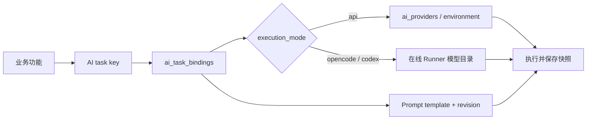
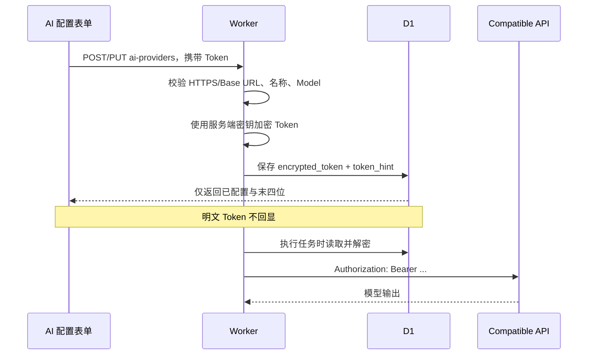

# AI 配置、提示词与凭据

LoongBoard 把“要执行的业务任务”“使用哪种引擎”“使用哪份 Prompt”“密钥保存在哪里”分成四层，避免某个功能直接硬编码模型或 Token。

## 配置解析顺序



例如 vLLM-Ascend PR 摘要使用任务键 `vllm_ascend_pr_summary`。它与 vLLM PR 摘要是不同绑定，即使两者暂时选择同一个模型，也可以使用不同 Prompt 和工作区策略。

任务目录位于 `frontend/worker/domain/ai-task-catalog.ts`，定义业务名称、作用仓库、默认引擎、默认工作区、更新策略、权限和 Prompt 功能键。

## 三种执行方式

| 方式 | 实际调用 | Token 来源 | 是否能读取本地仓库 |
| --- | --- | --- | --- |
| API 配置 | Worker 调用 OpenAI-compatible HTTP | Worker 环境变量或 D1 加密账户配置 | 否 |
| OpenCode | Runner 调用本机 OpenCode Server | OpenCode 本机 Provider 配置 | 按工作区和权限 |
| Codex | Runner 调用本机 Codex App Server | 本机 Codex 登录/认证 | 当前只读能力 |

“OpenAI-compatible”不是某个特定模型名称，而是接口协议。DeepSeek、Qwen 或其他服务只要提供兼容的 `/responses` 或 `/chat/completions` 路径，就可以在 AI 配置中填写它们的 Base URL、Model 和 Token。

## API Token 从页面到请求的过程



生产环境要求 HTTPS，并拒绝私有网络 Base URL；本地开发模式允许 localhost。更新配置时 Token 留空会保留原加密值。

环境变量配置使用：

```text
AI_API_BASE_URL
AI_API_MODE=responses|chat_completions
AI_MODEL
AI_API_KEY
```

它作为 `provider_config_id=environment` 的只读配置展示。

## 两种兼容协议怎样组装请求

`frontend/worker/integrations/ai/openai-compatible.ts` 只包含协议适配：

- Responses：POST `{baseUrl}/responses`，把每条消息转换为 `input_text`；
- Chat Completions：POST `{baseUrl}/chat/completions`，发送 `messages` 和 `temperature=0.2`。

非 2xx 响应保留最多 500 字符错误详情。响应为空或不含可用文本时按调用失败处理。

## Prompt 如何统一管理

每个任务定义一个 `featureKey`。系统默认 Prompt 来自代码目录；用户模板存入 `ai_prompt_templates`。任务绑定保存模板 ID，执行时解析：

```text
系统输出契约
+ 当前启用模板 instruction
+ 服务端注入的正文、版本、文件、Patch、Review 等上下文
```

页面不再让每个分析按钮临时输入 Prompt。其他页面最多跳转到设置；用户临时补充要求只作为本次业务输入，不能替代系统 Prompt，也不能扩大权限。

系统模板只读；自定义模板支持新增、复制、编辑、删除和启用。每次编辑产生新的 Revision。结果保存：

- `prompt_template_id`；
- 模板名称；
- Revision；
- 组合后的 `prompt_version`；
- 实际 Provider 和 Model。

因此同一功能切换 Prompt 后，摘要版本键会变化，需要时可重新生成，而旧结果仍能解释当时使用了什么。

## 本地引擎配置怎样选择

OpenCode/Codex 的 Provider 和 Model 目录来自 Runner 心跳，不由浏览器猜测。保存本地任务前，Worker 检查：

1. Runner 在线；
2. 选定引擎健康且已认证；
3. Provider/Model 在当前目录中；
4. 推理强度受该模型支持；
5. 权限档案被引擎和 Runner 允许；
6. 隔离开发只能使用 Worktree。

OpenCode/Codex 密钥不进入 D1。任务只保存引擎 ID、Provider ID、Model ID 与推理强度。

## 不可用与降级行为

- API 配置没有 Token：任务状态记为 failed；支持规则回退的功能可以保存明确标识为 fallback 的内容，不会伪装成模型结果。
- API 返回错误：记录最近错误并抛出，不自动切换到另一个 Provider。
- OpenCode/Codex 离线：拒绝入队或显示 Runner 离线，不静默改为 API。
- Prompt 输出结构错误：本地 Adapter 若支持格式纠正，会在同一 Session 内要求只修正 JSON 格式；业务结论不重新分析。
- 任务完成时版本已变化：结果拒绝覆盖当前摘要/分类，或作为旧版本报告保存。

## 代码入口

- AI 任务目录：`frontend/worker/domain/ai-task-catalog.ts`
- 任务解析与保存：`frontend/worker/services/ai-task-settings.ts`
- API Provider：`frontend/worker/services/ai-provider-settings.ts`
- API 执行：`frontend/worker/services/ai-execution.ts`
- Prompt 管理：`frontend/worker/services/prompt-resolution.ts`、`prompt-management.ts`
- 设置路由：`frontend/worker/routes/settings-ai.ts`、`settings-ai-tasks.ts`、`settings-prompts.ts`
