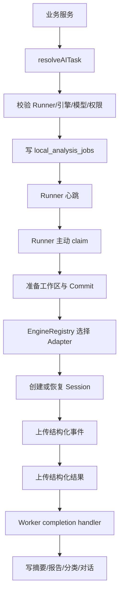

# 本地 Agent 任务生命周期

OpenCode 与 Codex 是可替换执行引擎，Local Runner 才是 LoongBoard 的本地任务基础设施。业务服务不会直接调用某个引擎的易变 API。

## 从业务操作到本地 Job

摘要、深度分析、洞察、领域地图、技术文档和仓库对话都通过统一的入队层：



入队时 Job 已携带任务键、Prompt 快照、版本、工作区模式、更新策略和权限档案，因此 Runner 不需要理解“PR 摘要页面”长什么样。

## Runner 如何连接 Worker

Runner 使用 `RunnerApi` 主动执行：

- `POST /api/local-runner/heartbeat`：报告在线、引擎健康、模型目录、仓库状态和活动任务数；
- `POST /api/local-runner/claim`：领取最高优先级可执行任务；
- `POST /jobs/{id}/running`：确认开始；
- `POST /jobs/{id}/events`：批量上传事件；
- `POST /jobs/{id}/complete`：上传完成、失败或取消结果。

这种拉取模型允许 Worker 部署在云端而本地仓库留在受信机器；无需把 OpenCode/Codex 端口暴露到公网。

## 工作区准备

### 无源码 `none`

在 `.loongboard/workspaces/{job-id}` 建立空目录，只使用任务输入。适合日报、普通文档等不需要源码的任务。

### 临时 Worktree `ephemeral_worktree`

一次性任务不再直接使用或切换 Runner 管理的共享仓库。Runner 会：

1. 按配置安全 Fetch；
2. 解析任务目标 Branch/Commit；
3. 在 `.loongboard/worktrees/{job-id}` 创建 detached Worktree；
4. PR 需要时同时创建 Base 与 Head Worktree；
5. 在隔离目录中执行 Agent；
6. 无论成功、失败还是取消，都执行 `git worktree remove --force`；
7. 删除本次 `{job-id}` 目录并记录 `worktree_cleanup` 事件。

不同任务使用不同 `job-id`，因此可以并行处理同一个仓库，不存在共享 Checkout 的分支切换和互斥租约。该模式不复用代码工作区；连续追问依赖 LoongBoard 保存的报告摘要、已确认事实和未解决问题，而不是保留临时目录。

### 会话 Worktree `worktree`

Runner 在 `.loongboard/worktrees/{job-id}` 使用：

```text
git worktree add --detach <path> <commit>
```

PR 可同时建立 Head 和 Base Worktree。指定 40 位 SHA 时先用 `git cat-file -e` 检查本地对象；Base/Head 都存在就跳过 Fetch，避免不必要的网络依赖。

Session 复用要求引擎、Commit、工作区模式和权限档案全部一致。仅该模式会保留工作区；过期 Worktree 由显式清理动作按保留时间删除。创建过程失败时，已经创建的部分仍会立即回收。

## 更新策略

- `none`：使用当前本地对象与引用；
- `fetch`：Runner 选择与规范 Clone URL 最匹配的 Remote，执行 `git fetch --prune`，必要时再抓取 PR ref。

Fetch 是工作区准备，不是模型工具权限。即使 Agent 使用 `safe_readonly`，Runner 也可以先完成配置允许的 Fetch。

## 权限强制

Runner 在 Agent Session 创建前解析权限：

| 档案 | 工具 | 命令范围 |
| --- | --- | --- |
| `safe_readonly` | read/grep/glob/LSP + 受控 bash | git status/log/show/diff/rev-parse/merge-base/branch/grep、rg |
| `community_research` | 上述 + web search/fetch | 额外允许只读 gh pr/issue/api；仅 OpenCode |
| `worktree_development` | 上述 + edit/write/patch | 只在 Worktree；额外允许轻量 typecheck/test/pytest；仅 OpenCode |

所有档案先 deny，再按具体 pattern allow；`.env`、credential、secret、外部目录、任意 Shell、commit、push、reset、clean、依赖安装和高资源测试默认禁止。Prompt 无法改变这些规则。

## Engine Adapter 解耦

`EngineRegistry` 只依赖统一合约：

```text
health
catalog
openSession
history
runStructured
cancel
normalizeEvent
modelCall
resultMetadata
stop
```

OpenCode 与 Codex 各自封装 Server API、Session 和事件格式。业务编排只传标准 Job，不出现大量 `if engine === ...` 分支。新增引擎需要实现同一合约并声明能力。

## 事件为什么不是原始终端

Runner 把引擎事件归一为任务开始、仓库准备、Git Fetch、Worktree、读取、搜索、Git 查询、模型调用、报告生成、完成、警告和错误。事件写入 `local_analysis_events`，前端按 `sequence` 增量读取。

不展示 ANSI/TUI 或隐藏推理；只展示工具动作、简短状态、可见回复和最终结果。

## 结果写回

Runner 首先校验模型返回的业务结构，再校验每条代码引用：

- repository 必须是已挂载仓库；
- commitSha 必须等于准备的 Commit；
- path 必须是工作区内真实文件且不能越界；
- 保存 symbol、startLine、endLine 和 reason。

Worker 根据 `job_type/purpose` 分发 completion handler，将相同 Runner 结果写入摘要、分析文档、分类、taxonomy、领域快照或对话。写入前再次验证当前业务版本，防止长任务覆盖新数据。

## 失败与取消

仓库准备、权限、模型、结构校验和落库失败分别产生事件与 `local_analysis_jobs.error`。取消把状态改为 `cancel_requested`，Adapter 在执行中查询状态并调用引擎取消。

代码入口：

- `frontend/local-runner/job-runner.mjs`
- `frontend/local-runner/analysis-job.mjs`
- `frontend/local-runner/git-worktrees.mjs`
- `frontend/local-runner/permission-profiles.mjs`
- `frontend/local-runner/engine-registry.mjs`
- `frontend/worker/services/local-runtime/`
