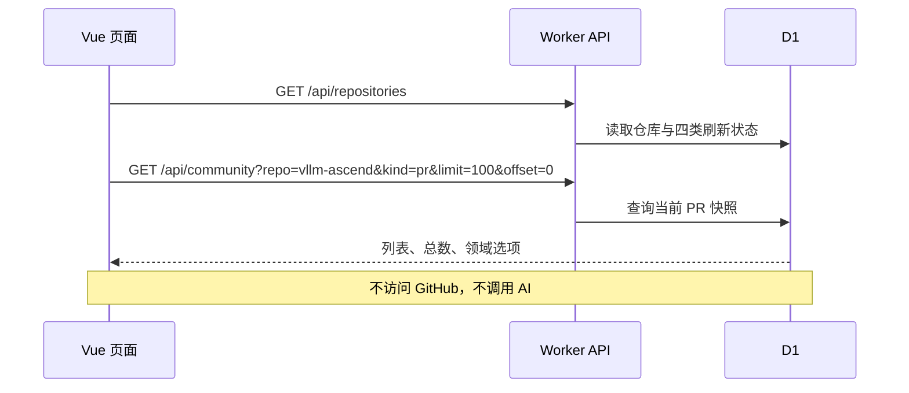
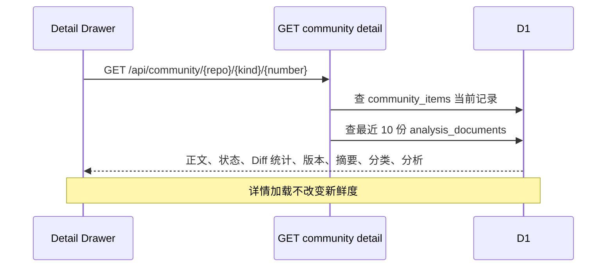

# 仓库社区页：PR、Issue 与详情

该页面同时服务 `vllm` 和 `vllm-ascend`。仓库只是查询参数和任务作用域，不会复制两套页面代码或在前端硬编码两份数据。

## 页面加载时发生什么



应用初始化还会并行读取关注列表、文档数量、洞察数量和跨仓库影响，用于侧边栏计数；这些请求同样只读 D1。

前端入口：

- 页面状态：`frontend/src/composables/useCommunityWorkspace.ts`
- 列表：`frontend/src/components/CommunityList.vue`
- 单行：`frontend/src/components/CommunityRow.vue`
- 仓库头部与刷新状态：`frontend/src/components/RepositoryHeader.vue`
- HTTP 调用：`frontend/src/api/community.ts`

## 筛选、排序和分页

列表查询由浏览器把条件显式传给 `GET /api/community`：

| 页面条件 | API 参数 | D1 行为 |
| --- | --- | --- |
| PR / Issue | `kind=pr|issue` | `kind = ?` |
| 技术领域 | `domain` | `domain = ?` |
| 当前状态 | `state` | open/draft/merged/closed；reopened 读取最近非 updated 事件 |
| 日期范围 | `from`、`to` | 北京时间日期转换为 UTC 半开区间 |
| 搜索 | `q` | 标题、正文、摘要、作者和编号模糊查询 |
| 最近更新 | `sort=updated` | `updated_at DESC, number DESC` |
| 编号倒序 | `sort=number` | `number DESC, updated_at DESC` |
| 分页 | `limit=100&offset=N` | D1 `LIMIT/OFFSET`，同时单独 `COUNT(*)` |

筛选变化后前端等待 180ms 再请求，避免连续输入产生大量查询。每页固定 100 条，页面序号按 `offset + 当页位置 + 1` 显示，因此第二页从 101 开始。

Worker 入口为 `frontend/worker/routes/community.ts`，SQL 位于 `frontend/worker/repositories/community.ts`。

## 点击 PR/Issue 时发生什么



前端使用 `useCommunityDetail.ts` 给每次详情请求分配 request id。用户快速切换条目时，较旧请求即使后返回也不会覆盖当前抽屉。

详情展示：

- GitHub Markdown 正文；
- PR 的 Base/Head SHA、文件数、增删行和 Review/CI 信号；
- 摘要的状态、对应版本、Prompt、Provider 和 Model；
- 分类的领域、置信度、证据和对应 Head SHA；
- 深度分析状态、历史报告和版本是否过期。

## 代码修改为什么默认只有 `diff --stat`

事实刷新只保存每个文件的路径、additions 和 deletions，不保存完整 Patch。详情先用这些字段绘制 `git diff --stat` 风格的文件列表。

用户点击“获取代码修改”后才请求：

```text
GET /api/community/{repo}/pr/{number}/diff-files
  → ensurePullPatches
  → GitHub raw diff
  → 若不完整，再分页调用 pulls/{number}/files
```

单文件 `additions + deletions > 1000` 时不会获取 Patch，该文件保持不可展开并提示到 GitHub 查看。其余文件统一请求，不要求用户逐个文件点击。该行为位于 `frontend/worker/services/pull-details.ts` 和 `frontend/worker/integrations/github/pulls/files.ts`。

## 详情中的四个动作完全独立

| 按钮 | 请求 | 只做什么 |
| --- | --- | --- |
| 刷新社区事实 | `POST /api/repositories/{repo}/refresh/facts`，携带 `itemId` | 重新读取这一条 GitHub 事实并判断过期 |
| 更新摘要 | 同一路径，任务类型为 `summary` | 使用数据库事实和必要 Patch 生成当前版本摘要 |
| 重新分类 | 任务类型为 `classification` | 强制对这一条重新执行分类 |
| 开始深度分析 | `POST /api/community/{repo}/{kind}/{number}/analyze` | 根据该任务绑定选择 API 或本地 Agent |

打开详情不会自动执行任何一个动作；一个按钮也不会隐式触发其他三个动作。

更深的刷新和分析流程见：

- [PR/Issue 社区事实刷新](../flows/01-community-facts-refresh.md)
- [摘要、分类与深度分析](../flows/02-summary-classification-deep-analysis.md)

## 页面错误从哪里来

| 表现 | 主要排查位置 |
| --- | --- |
| 列表为空或数量不对 | `/api/community` 返回的 `total/items`、查询筛选、`community_items` |
| 新条目打不开 | `repo/kind/number` 是否与 D1 唯一键一致、详情路由是否命中 |
| Patch 为空 | `diff_json` 是否有文件、是否全部超过 1000 行、GitHub 是否返回 raw diff |
| 摘要长时间运行 | `community_summary_jobs`、`local_analysis_jobs` 与前端 15 分钟轮询 |
| 报告显示旧版本 | 当前 `head_sha/body_hash/files_hash` 与报告绑定版本不一致 |
