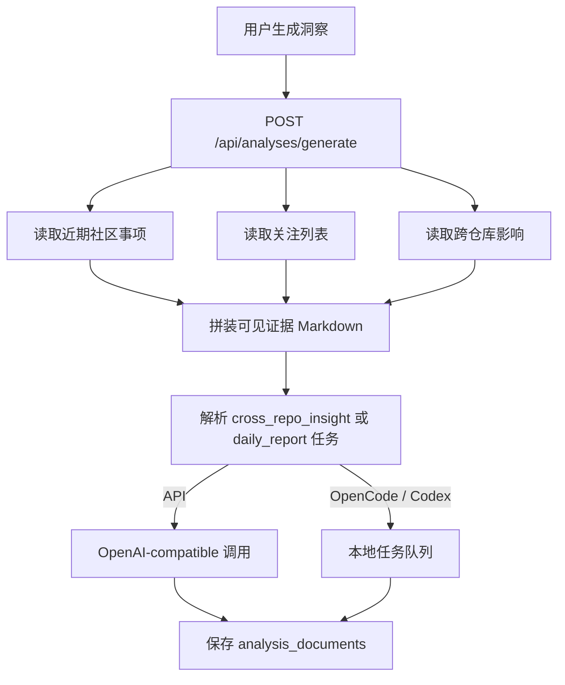

# AI 洞察与今日分析页面

AI 洞察保存为完整 Markdown 文档，不是临时卡片。页面读取 `analysis_documents`，生成动作才会调用 AI。

## 两种洞察来源

| 类型 | 输入 | 是否读取本地代码 |
| --- | --- | --- |
| 普通跨仓库洞察 / 今日分析 | D1 中已同步的社区事项、关注列表、跨仓库影响、领域计数 | 否 |
| 本地代码证据洞察 | 用户明确选择的 PR/Issue 或领域 + 本地仓库 | 只有本地 Agent 实际读取且产生有效代码引用后才标记为是 |

普通洞察不会为了“更完整”隐式扫描整个仓库；本地代码证据必须由用户勾选目标。

## 普通洞察生成流程

今日分析使用北京时间自然日窗口，并对观察事件去重；它不会把“今天查询到”误写成“今天创建”。跨仓库洞察额外加入用户关注项和跨仓库影响证据。

Worker 入口：`frontend/worker/routes/analysis.ts`。

## 本地代码证据洞察

当 `useLocalCode=true` 且 `local_code_insight` 绑定到 OpenCode/Codex 时：

1. 校验至少选择一个目标；
2. 建立 `insight_evidence` 本地任务；
3. Runner 按任务的仓库、版本、工作区和权限准备代码；
4. Agent 搜索相关文件、符号、调用链和测试；
5. 结构化事件持续写入 `local_analysis_events`；
6. 最终 Markdown、Commit 和代码引用保存到 `analysis_documents`；
7. 只有 `sourceRead=true` 且至少一条代码引用通过路径/Commit 校验时，`local_evidence` 才为真。

若 `local_code_insight` 被配置成 API，系统会明确说明没有读取本地源码，不能在报告中声称包含本地代码证据。

## 页面刷新和恢复

页面刷新后重新读取分析文档和未完成的本地任务。过程事件不是只存在浏览器内存中，而是按 `job_id + sequence` 保存，因此可以恢复“准备仓库、读取文件、搜索、模型调用、生成报告”等可见动作。

最终报告应区分：

- 社区数据结论；
- 本地代码证据；
- AI 推断；
- 当前无法确认的内容。

## 代码入口

- 洞察页面：`frontend/src/components/AIInsightsView.vue`
- 文档展示与事件区：`frontend/src/components/AnalysisDocumentWorkspace.vue`
- 前端 API：`frontend/src/api/content.ts`
- Worker 生成路由：`frontend/worker/routes/analysis.ts`
- 本地洞察入队：`frontend/worker/services/local-runtime/insight.ts`
- 本地结果落库：`frontend/worker/services/local-runtime/completion-handlers.ts`
