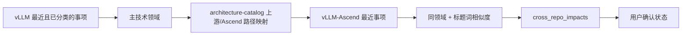

# 关注列表与跨仓库影响页面

这两个页面都建立在已同步的 `community_items` 上，但用途不同：关注列表是个人工作队列，跨仓库影响是 vLLM 上游变化与 vLLM-Ascend 适配面的关系记录。

## 关注列表

用户在 PR/Issue 行点击星标后，前端以条目业务主键提交：

```text
POST /api/watchlist/vllm-ascend:pr:13642
{
  reason: "持续关注",
  note: "...",
  priority: "P2",
  nextCheck: "明天"
}
```

`watchlist` 使用 `(user_id, item_id)` 作为主键，因此不同账户有独立关注项，同一账户不会重复收藏。删除使用相同路径的 `DELETE`。

关注页面读取时将关注元数据与最新 `community_items` 联表，所以事实刷新后标题、状态和摘要会更新，但用户备注、优先级和复查时间保持不变。

代码入口：

- 页面：`frontend/src/components/WatchlistView.vue`
- 前端状态：`frontend/src/composables/useCommunityWorkspace.ts`
- Worker 路由：`frontend/worker/routes/content.ts`
- D1 查询：`frontend/worker/repositories/content.ts`

## 跨仓库影响

当前规则从最近的 vLLM 技术变化出发，寻找 vLLM-Ascend 的可能适配面：



规则只生成“可能受影响”的候选，不把路径映射当作已经完成适配的证据。记录包含：

- vLLM 来源 PR/Issue；
- 主技术领域；
- 来源修改路径；
- 建议核对的 Ascend 路径；
- 可能关联的 vLLM-Ascend PR/Issue；
- 风险等级、当前确认状态和证据引用。

用户可以把状态改为已确认、无需适配等人工结论。后续规则刷新只覆盖未审查或可能受影响状态，不覆盖人工确认结果。

当前实现说明：`refreshCrossRepoImpacts` 规则函数已经存在，但尚未接入 Facts 刷新、定时任务或页面“重新生成”按钮。当前页面只读取 D1 中已有的 `cross_repo_impacts`，因此不能把页面记录描述成“每次社区刷新都会自动重算”。接入时应作为独立任务运行，不能阻塞社区事实刷新。

代码入口：

- 页面：`frontend/src/components/CrossRepoImpactView.vue`
- API：`GET /api/impacts`、`PATCH /api/impacts/{id}`
- 规则：`frontend/worker/intelligence.ts`
- 领域路径基线：`frontend/worker/domain/architecture-catalog.ts`

## 与 AI 洞察的关系

跨仓库影响本身先由规则产生，AI 洞察可以把这些记录作为证据生成详细报告。若用户选择本地代码证据，Agent 才会进一步读取两个仓库；没有本地读取时，页面只能表达“候选影响”，不能表达“已经验证实现”。
