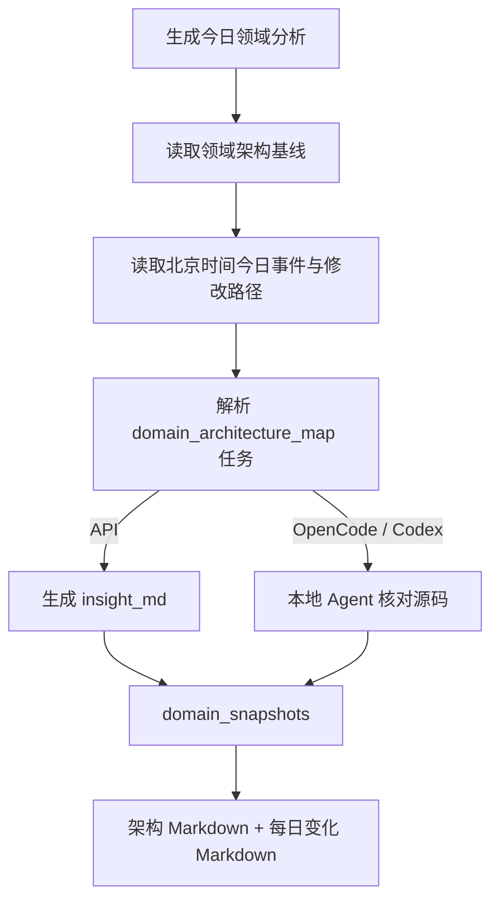

# 技术领域地图与技术文档页面

技术领域地图不是 PR 分类标签的统计图，而是“稳定架构基线 + 最近活动 + 当日变化 + 可生成快照”的领域知识视图。

## 一个领域由哪些部分组成

| 部分 | 来源 | 是否每天改变 |
| --- | --- | --- |
| 领域说明、执行链、架构阶段 | `architecture-catalog.ts` 维护基线 | 否，需随代码架构人工维护 |
| 映射的 vLLM / vLLM-Ascend 分类 | 架构目录中的 taxonomy 映射 | 规则变化时更新 |
| 近 7 天 PR/Issue/风险趋势 | D1 当前社区事项聚合 | 是 |
| 北京时间当日事件与修改路径 | `community_events` + `diff_json` | 是 |
| 当日 AI 解读 | 手动创建的 `domain_snapshots` | 用户生成时更新 |

`GET /api/domains` 只做 D1 聚合和基线组合，不调用 AI。页面可直接查看领域执行流、阶段、最近热度、今日事件和已生成快照。

## 创建每日领域快照

快照按 `(domain, snapshot_date)` 唯一，保存 Prompt 模板、版本、模型、Provider 和生成来源。稳定架构 Markdown 与当日洞察分开保存，避免某一天的 PR 活动直接改写长期架构定义。

当前代码入口：

- 页面：`frontend/src/components/DomainMapView.vue`
- 服务：`frontend/worker/services/domain-maps.ts`
- 架构基线：`frontend/worker/domain/architecture-catalog.ts`
- D1：`domain_snapshots`

## 技术文档知识库

技术文档按 `category` 分类保存 Markdown，支持标题、摘要、标签和来源引用。普通浏览只读取 `technical_documents`。

生成文档时采用“草稿 → AI 整理 → 人工确认 → 保存”的流程：

1. 用户输入技术分类、标题、Markdown 草稿、标签和来源；
2. `POST /api/documents/generate` 解析 `technical_document_generation` 任务；
3. API 模式同步返回改写草稿；本地 Agent 模式进入任务队列；
4. AI 结果只进入编辑器或分析文档，不自动覆盖已有技术文档；
5. 用户确认后再 `POST /api/documents` 或 `PUT /api/documents/{id}`。

技术文档和领域地图的区别：

- 领域地图描述一个领域的整体结构与每日变化；
- 技术文档记录具体机制、操作方式、设计分析或维护经验；
- AI 可以生成草稿，但知识库保存动作始终由用户确认。

代码入口：

- 页面：`frontend/src/components/TechnicalDocsView.vue`
- 前端 API：`frontend/src/api/content.ts`
- Worker 路由：`frontend/worker/routes/content.ts`
- D1：`technical_documents`
