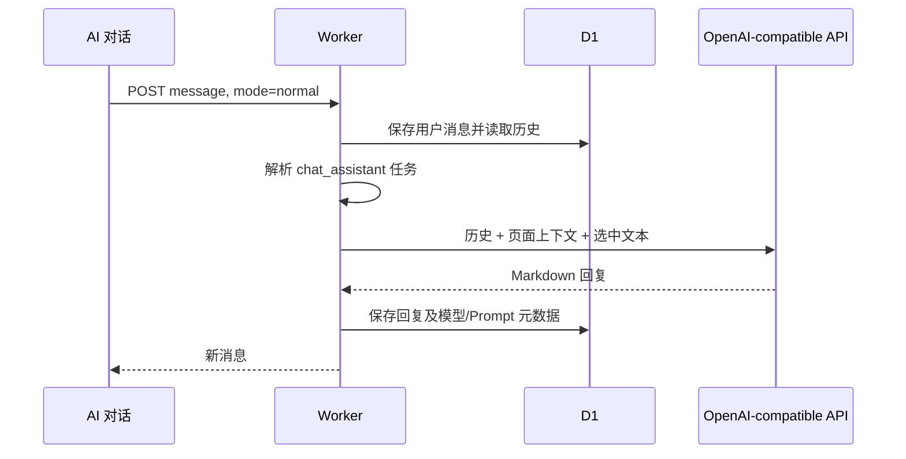

# AI 对话与悬浮助手页面

侧边栏 AI 对话页和悬浮助手复用同一组 `chat_threads`、`chat_messages` 与 `useAIChat.ts` 状态。区别只是展示容器，不会产生两套互不相通的会话。

## 会话记录

用户可以新建、切换、重命名、删除和继续多个会话：

- `GET/POST /api/chat/threads`：列出或新建；
- `PUT/DELETE /api/chat/threads/{id}`：改名或删除；
- `GET/POST /api/chat/threads/{id}/messages`：读取或发送消息。

消息正文保存为 Markdown，消息 `context_json` 记录页面上下文、滑词选中内容，以及实际使用的执行方式、Provider、Model、Prompt 版本、Runner Job、Commit 和代码引用。

## 普通对话

若 `chat_assistant` 被明确绑定到 OpenCode/Codex，系统会把该次对话转换成仓库分析模式并进入本地队列；不会伪装成普通直连 API。

## 仓库分析对话

用户选择仓库范围和目标 Branch/Commit 后，`repository_code_chat` 任务决定 OpenCode 或 Codex、模型、工作区、更新方式和权限。

本地流程会：

1. 先保存用户消息；
2. 创建 `repository_chat` Job；
3. 根据 `threadId` 形成稳定 `session_scope`；
4. 只有仓库范围、目标版本和引擎上下文一致时才复用 Agent Session；
5. 版本变化时创建新的代码上下文，但把已确认事实、未解决问题和关注点作为显式记忆传入；
6. Runner 上传工具事件，页面实时追加；
7. 最终回复保存 Commit、代码引用和是否真的读取源码。

普通模式不会因为页面上存在仓库信息而自动启动 OpenCode。仓库模式若使用直连 API，回复会明确 `localEvidence=false`，不得声称已经搜索本地代码。

## 滑词与页面定位

页面选中的文本通过 `selection` 发送，当前页面说明通过 `pageContext` 发送。它们属于本轮消息上下文，不会授予模型读取浏览器 DOM、Token 或本地文件的额外能力。

## 恢复、取消和错误

前端轮询本地 Job；刷新页面后会根据线程中的 `runner_job_id` 恢复未完成任务和历史事件。取消请求把 Job 标记为 `cancel_requested`，Runner 在模型/工具事件边界检查状态并中止。

代码入口：

- 页面：`frontend/src/components/AIChatView.vue`
- 悬浮窗：`frontend/src/components/AIChatDock.vue`
- 前端状态：`frontend/src/composables/useAIChat.ts`
- Worker 路由：`frontend/worker/routes/chat.ts`
- 本地对话入队：`frontend/worker/services/local-runtime/chat.ts`
- 本地回复落库：`frontend/worker/services/local-runtime/completion-handlers.ts`

本地执行细节见 [本地 Agent 任务生命周期](../flows/04-local-agent-execution.md)。
