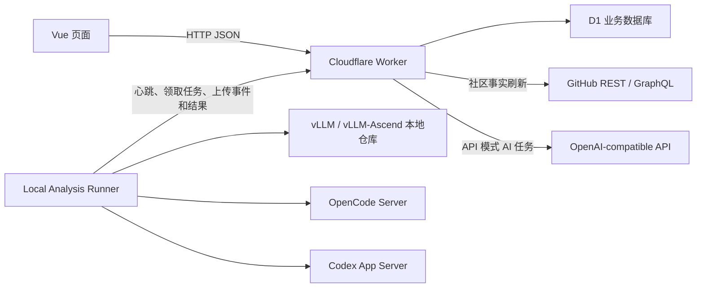
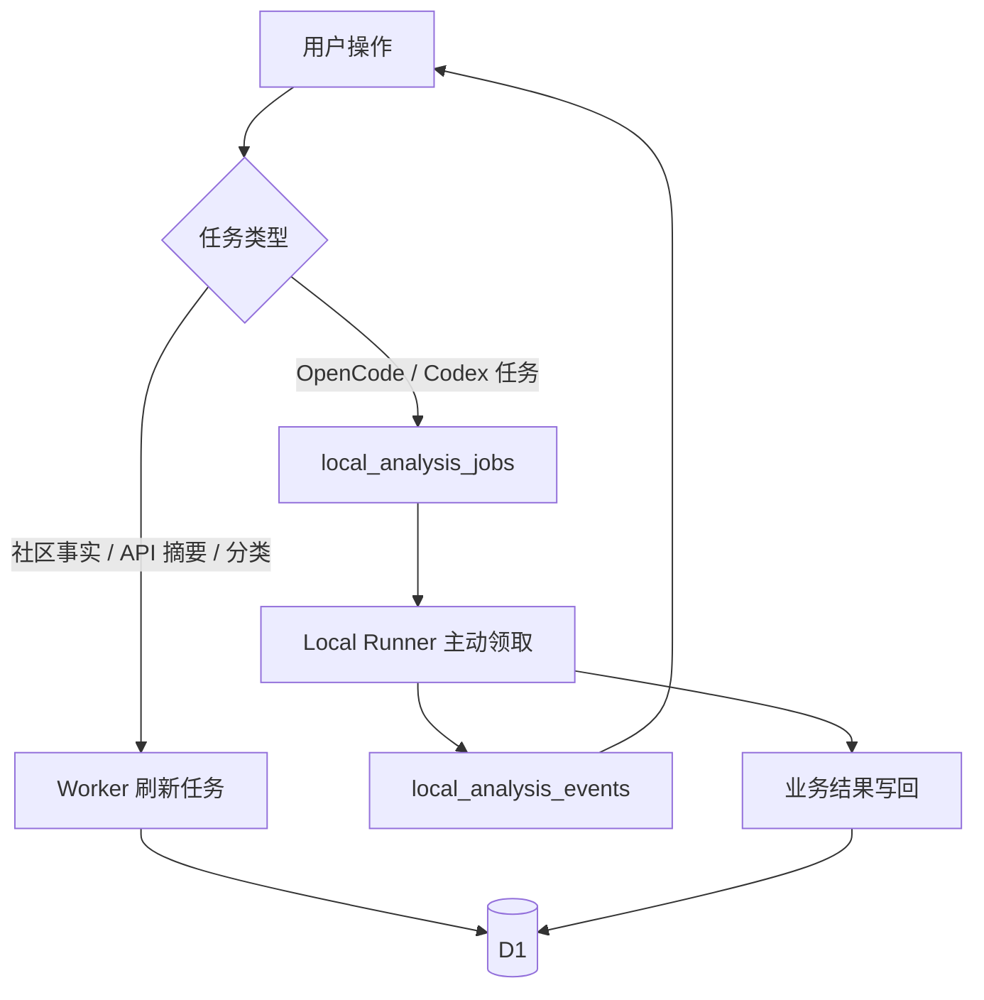

# 运行时拓扑与职责边界

## 一次用户操作会经过哪些进程

浏览器始终只连接 Worker。即使选择 OpenCode 或 Codex，浏览器也不会获得本地服务地址、仓库绝对路径、Runner Token 或本地模型认证信息。

## 五个运行时各自负责什么

| 运行时 | 负责 | 不负责 |
| --- | --- | --- |
| Vue 前端 | 页面状态、筛选、按钮、轮询任务事件、Markdown 展示 | 不直接请求 GitHub，不持久化业务配置，不连接本地 Agent |
| Worker | 鉴权、API 输入校验、用例编排、D1 读写、GitHub 与直连 AI 调用、Runner 队列 | 不访问用户本地磁盘，不直接运行 OpenCode/Codex |
| D1 | 当前社区事实、刷新水位、AI 配置绑定、Prompt、任务、事件、文档和会话 | 不保存本地仓库内容，不保存明文密钥 |
| Local Runner | 主动领取本地任务、准备仓库版本、执行权限策略、适配本地引擎、上传结构化事件 | 不决定某个业务功能该使用什么 Prompt，不直接服务浏览器 |
| OpenCode / Codex | 在 Runner 提供的目录与权限内完成模型调用和工具动作 | 不写 D1，不决定任务状态，不接收浏览器请求 |

## 同步任务与本地任务不是同一条队列

事实刷新使用 `refresh_task_runs`；OpenCode/Codex 使用 `local_analysis_jobs`。本地任务完成后，Worker 的 completion handler 再把结果写入摘要、分析文档、分类或对话表。两条队列分开，避免 GitHub 刷新等待本地模型，也避免本地 Runner 离线阻塞普通页面。

## 主要代码入口

| 边界 | 当前入口 |
| --- | --- |
| Vue 根视图与页面切换 | `frontend/src/App.vue` |
| 前端 HTTP 封装 | `frontend/src/api/` |
| Worker API 路由 | `frontend/worker/routes/api.ts` |
| Worker 服务编排 | `frontend/worker/services/` |
| D1 SQL 仓库 | `frontend/worker/repositories/` |
| GitHub 集成 | `frontend/worker/integrations/github/` |
| OpenAI-compatible 集成 | `frontend/worker/integrations/ai/openai-compatible.ts` |
| Local Runner 主循环 | `frontend/local-runner/index.mjs` |
| 本地任务执行 | `frontend/local-runner/job-runner.mjs`、`analysis-job.mjs` |
| OpenCode / Codex Adapter | `frontend/local-runner/engines/` |
| D1 迁移 | `frontend/drizzle/` |

## 一个重要判断方式

排查问题时先确定失败发生在哪一段：

1. 页面请求是否到达 Worker；
2. Worker 是否成功读取或写入 D1；
3. 若为 GitHub 任务，REST/GraphQL 是否返回完整边界；
4. 若为本地任务，Runner 是否在线、是否领取；
5. 仓库准备是否成功；
6. 模型是否返回符合业务结构的结果；
7. completion handler 是否因版本变化拒绝写入。

页面上的一条“分析失败”不能直接说明模型失败，必须结合 `refresh_task_runs`、`local_analysis_jobs` 和 `local_analysis_events` 判断具体阶段。
